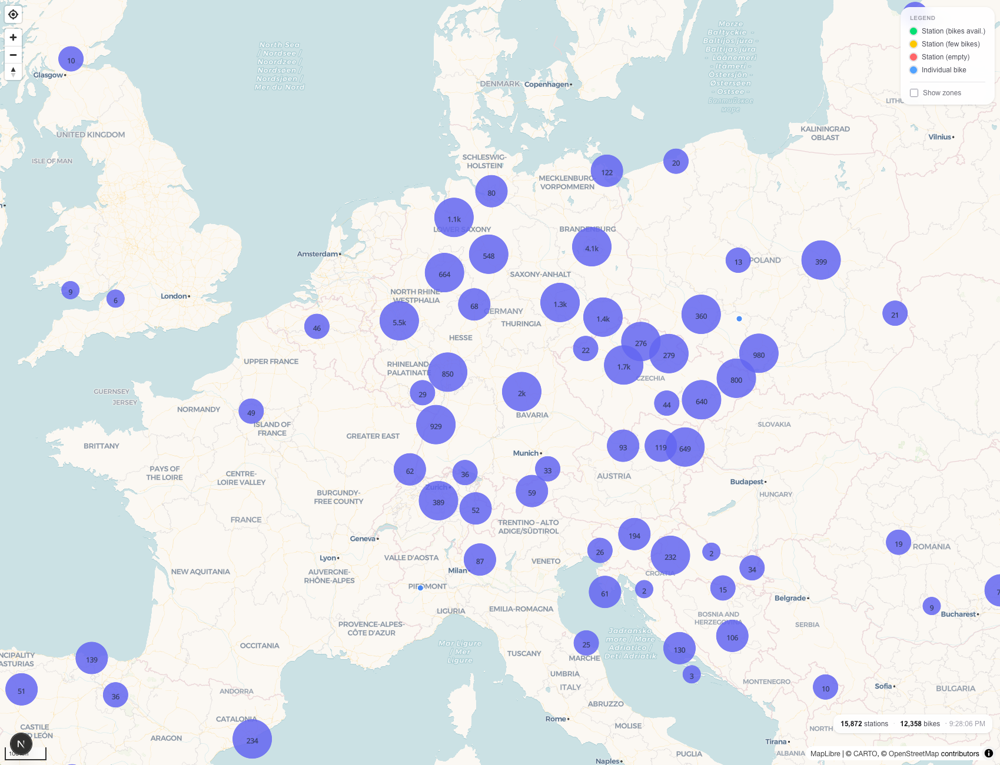
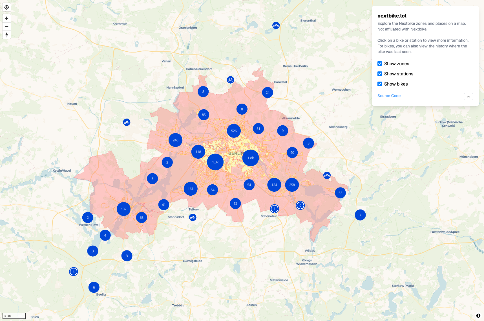
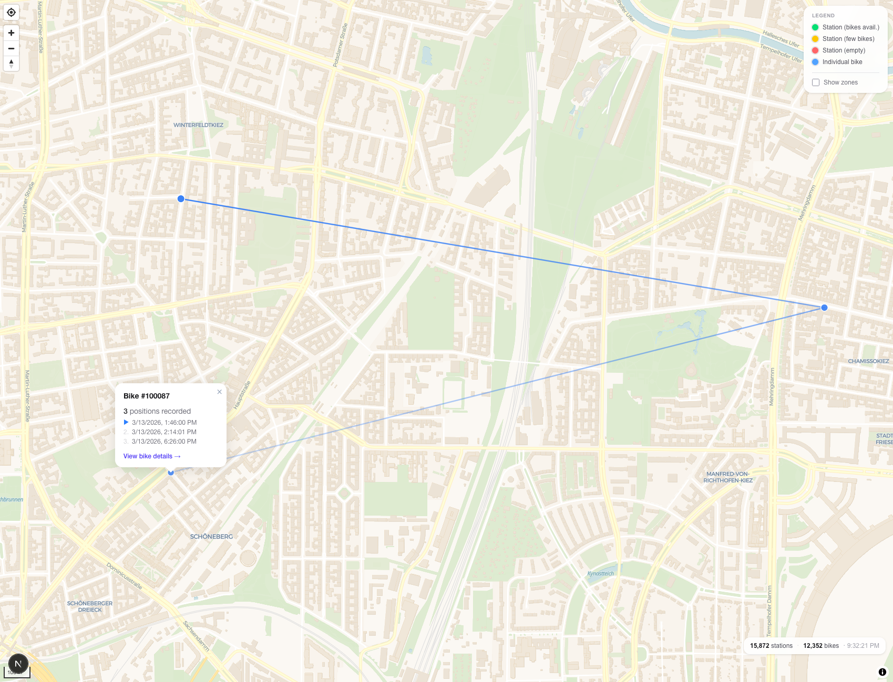

# nextbike.lol

nextbike.lol is a exploratory project that collects and visualizes data from [nextbike](https://nextbike.net).

Right now the scraper is capable of collecting all bike positions over time and their corresponding places and cities. It also collects the zones in which bikes can be parked.

