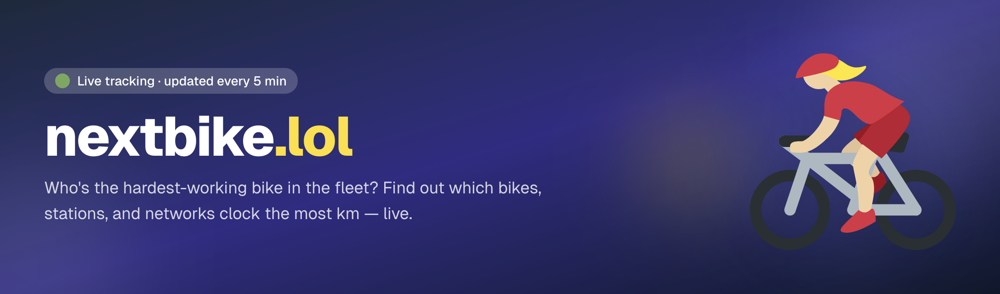
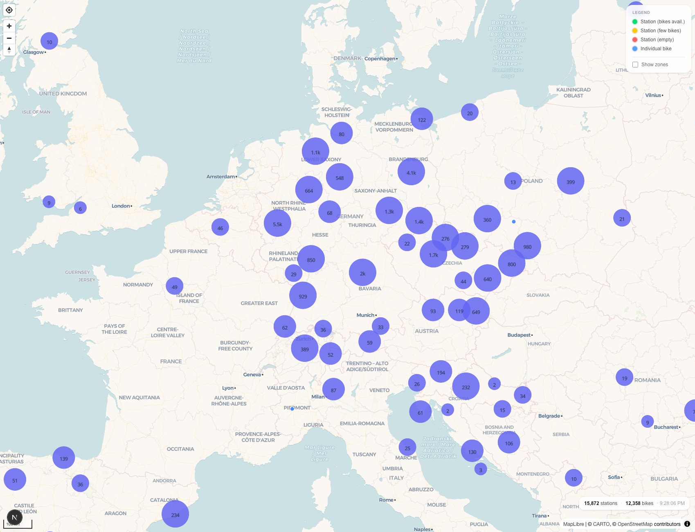
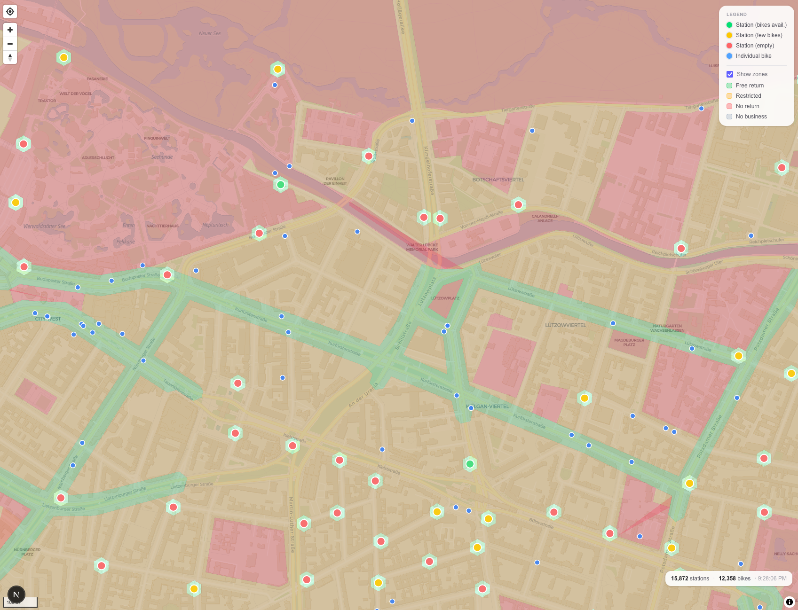
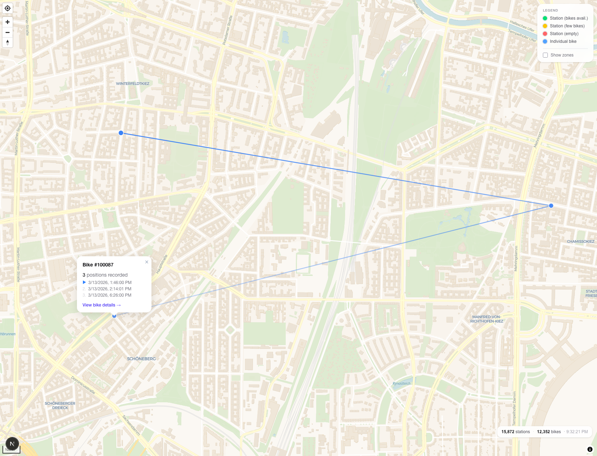

# nextbike.lol

nextbike.lol is a exploratory project that collects and visualizes data from [Nextbike](https://nextbike.net).

It's scraping the [live endpoint of the official Nextbike API](https://api.nextbike.net/maps/nextbike-live.json) every minute and storing the data in a PostgreSQL database. Every 10 minutes a materialized view is refreshed to calculate bike movements from the scraped data.

## See bike positions across Europe

## Zoom in on a specific area

## See the position history of a bike

## Other Ideas

- [ ] Bike heatmap
- [ ] Replay of bike movement
- [ ] "Highway" & "Hotspot" detection
- [ ] Nextbike revenue estimation
- [ ] Average trip length
- [ ] Activity by weekday and time (or external data sources like weather)
- [ ] Bike travel distance leaderboard
- [ ] Let users “adopt” a bike and follow its adventures daily, like a Tamagotchi on wheels

Inspired by [visualization.bike](https://www.visualization.bike)
