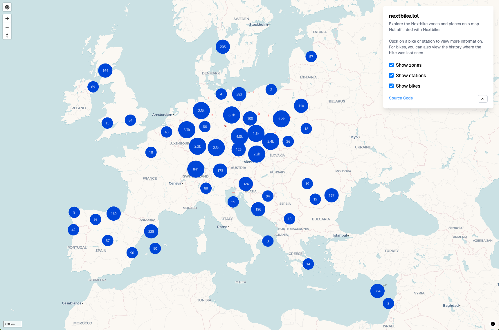

# nextbike.lol

nextbike.lol is a exploratory project that collects and visualizes data from [nextbike](https://nextbike.net).

Right now the scraper is capable of collecting all bike positions over time and their corresponding places and cities. It also collects the zones in which bikes can be parked.

## See bike positions across Europe

## Zoom in on a specific area

## See the position history of a bike

## Other Ideas

- [ ] Bike heatmap
- [ ] Replay of bike movement
- [ ] "Highway" & "Hotspot" detection
- [ ] Nextbike revenue estimation
- [ ] Average trip length
- [ ] Activity by weekday and time (or external data sources like weather)
- [ ] Bike travel distance leaderboard
- [ ] Let users “adopt” a bike and follow its adventures daily, like a Tamagotchi on wheels

Inspiration from https://www.visualization.bike
